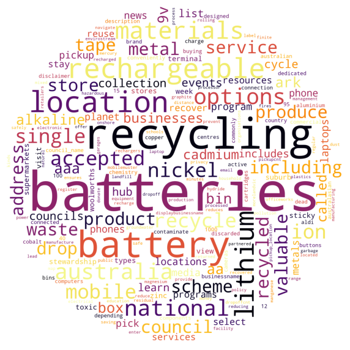
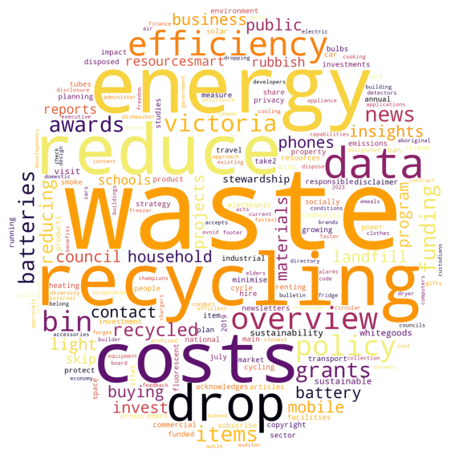
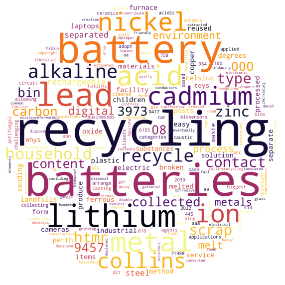
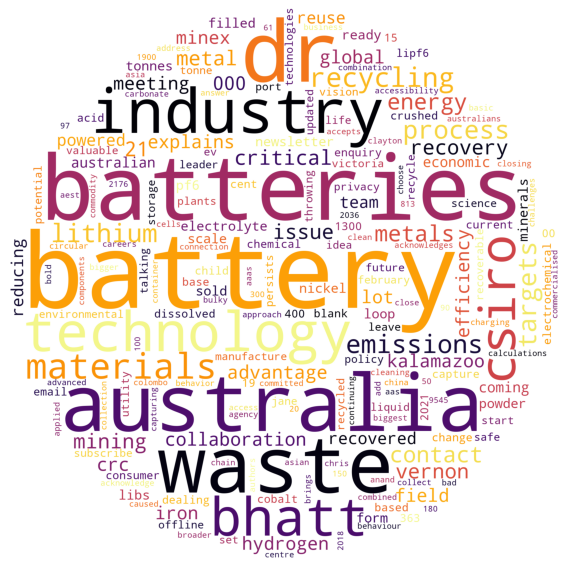
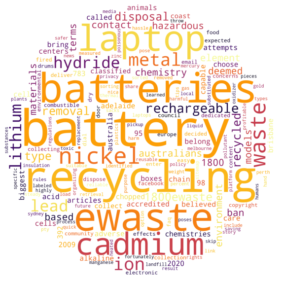
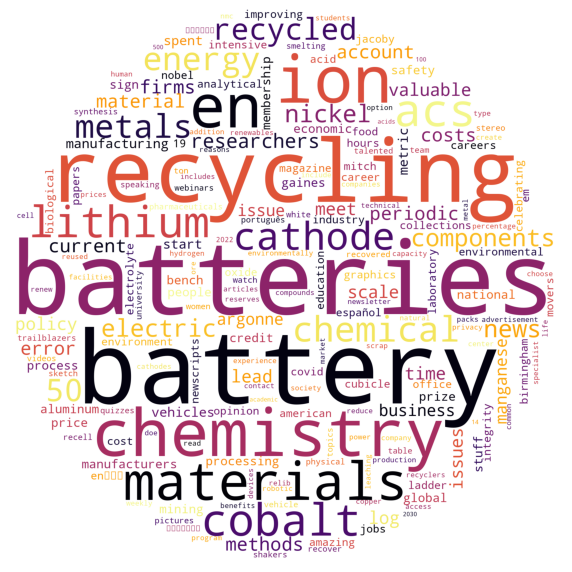
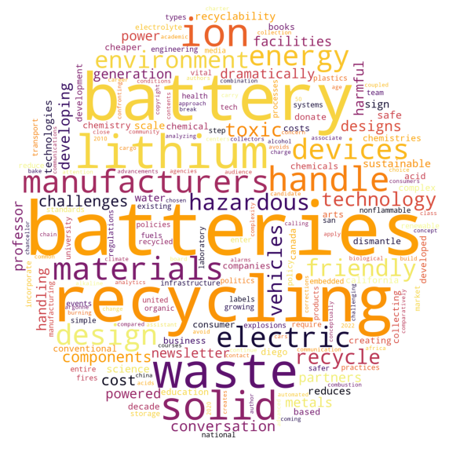
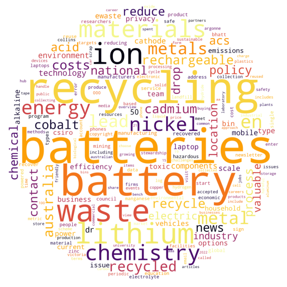

# Version 0.2
## Relevant Commits
| Commit | Date |
| - | - |
| d10b040 | 10/08/2022 |
## Summary
Version 0.1 was extended to complete a keyword occurrence analysis on each Google Search result produced by the GoogleSearchSpider. WordCloud generation was also added to visualize the occurrences of words in each page.
## Results
Version 0.1 was used to complete a crawl of the first page of google search results for the following keywords: **Metal**, **E-waste**, and **Batteries**. Each resulting google search entry was then scrapped for an occurrence analysis. 
The following shows 9 word clouds, 8 of which represent individual websites, and the last one representing the aggregate collection of words for all 8 sites.
| Word Cloud | Website |
| - | - |
 |[Battery Recycling in the City of Melbourne area](https://recyclingnearyou.com.au/batteries/MelbourneVIC)
 |[Battery Recycling in the Moreland City Council area](https://recyclingnearyou.com.au/batteries/MorelandVIC)
 |[Recycle e-waste - Sustainability Victoria](https://www.sustainability.vic.gov.au/recycling-and-reducing-waste/at-home/recycling-at-home/e-waste)
 |[Scrap Battery Recycling: What You Need to Know](https://www.collinsrecycling.com.au/hows-and-whys-of-scrap-battery-recycling/)
 |[Closing the loop on energy metals - CSIRO](https://www.csiro.au/en/work-with-us/industries/mining-resources/resourceful-magazine/issue-21/closing-the-loop)
 |[Laptop Battery Ewaste Removal - 1800Ewaste](https://www.ewaste.com.au/ewaste-articles/laptop-battery-ewaste-removal/)
 |[Its time to get serious about recycling lithium-ion batteries - C&EN](https://cen.acs.org/materials/energy-storage/time-serious-recycling-lithium/97/i28)
 |[Designing batteries for easier recycling could avert a looming e ...](https://theconversation.com/designing-batteries-for-easier-recycling-could-avert-a-looming-e-waste-crisis-146065)
 |*Aggregate Results*
___

### Challenges
- Durability of connections to websites (eventuating bans / bot detection prevents scrapping)
- Quality of the stop-words used can either positively or negatively contribute to the occurrence analysis

### What's Next
- Refactoring the web scrapping code to external modules, and importing as required
- Further analysis, using the results of the occurrence analysis